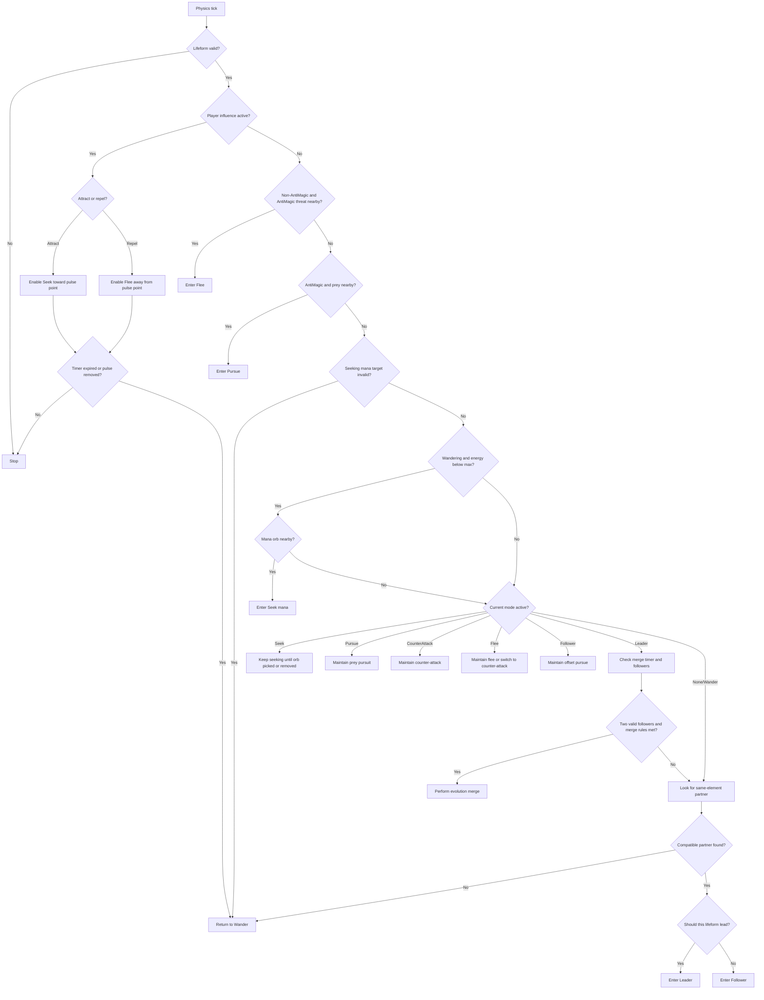
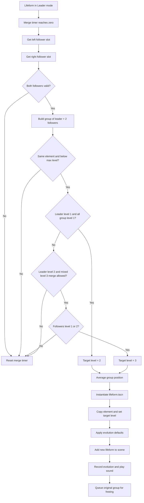
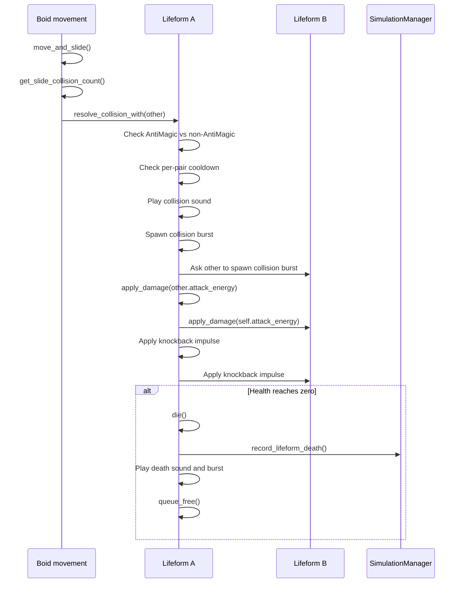
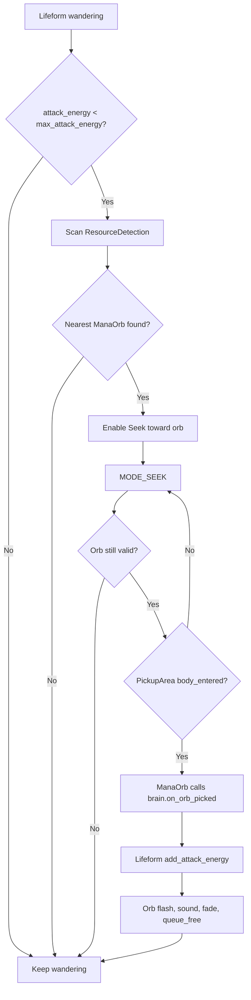

# Behaviour Tree And State Transition Diagrams

This document shows the high-level decision structure used by `lifeform_brain.gd`. The actual implementation is a finite state machine with priority checks, but the first diagram presents it like a behaviour tree because that is easier to explain for the assignment.

## Behaviour Priority Tree

## Main State Machine

```mermaid
stateDiagram-v2
    [*] --> WANDER

    WANDER --> SEEK: Mana nearby and energy < max
    SEEK --> WANDER: Orb picked / target removed

    WANDER --> LEADER: Compatible partner found and this lifeform leads
    WANDER --> FOLLOWER: Compatible partner found and other lifeform leads

    FOLLOWER --> WANDER: Leader invalid / incompatible
    LEADER --> WANDER: No followers and no compatible partner
    LEADER --> EVOLVING: Two followers + merge rules pass
    EVOLVING --> WANDER: New evolved lifeform spawned

    WANDER --> FLEE: Normal element detects AntiMagic threat
    FLEE --> COUNTER_ATTACK: Threat within aggro_radius
    COUNTER_ATTACK --> FLEE: Threat outside aggro_radius but still detected
    FLEE --> WANDER: Threat gone / out of detection range
    COUNTER_ATTACK --> WANDER: Threat gone / out of detection range

    WANDER --> PURSUE: AntiMagic detects non-AntiMagic prey
    PURSUE --> WANDER: Prey gone / out of detection range

    WANDER --> PLAYER_ATTRACT: Q attract pulse affects lifeform
    WANDER --> PLAYER_REPEL: E repel pulse affects lifeform
    SEEK --> PLAYER_ATTRACT: Player pulse priority
    SEEK --> PLAYER_REPEL: Player pulse priority
    LEADER --> PLAYER_ATTRACT: Player pulse priority
    LEADER --> PLAYER_REPEL: Player pulse priority
    FOLLOWER --> PLAYER_ATTRACT: Player pulse releases follower slot
    FOLLOWER --> PLAYER_REPEL: Player pulse releases follower slot
    PURSUE --> PLAYER_ATTRACT: Player pulse priority
    PURSUE --> PLAYER_REPEL: Player pulse priority
    FLEE --> PLAYER_ATTRACT: Player pulse priority
    FLEE --> PLAYER_REPEL: Player pulse priority
    COUNTER_ATTACK --> PLAYER_ATTRACT: Player pulse priority
    COUNTER_ATTACK --> PLAYER_REPEL: Player pulse priority
    PLAYER_ATTRACT --> WANDER: Pulse timer expires / pulse removed
    PLAYER_REPEL --> WANDER: Pulse timer expires / pulse removed
```

## Evolution State Flow

## Combat State Flow

## Mana Seeking Flow

## Notes For Explaining The System

- The code is not a formal behaviour tree implementation. It is a priority-driven finite state machine.
- The behaviour-tree view is still useful because the brain checks high-priority needs first, then falls through to lower-priority social/evolution behavior.
- `Constrain` and `Avoidance` are not separate states. They are support behaviors kept active inside every state.
- Player pulses intentionally override normal autonomy for a short time, then release the lifeforms back to normal decision-making.
