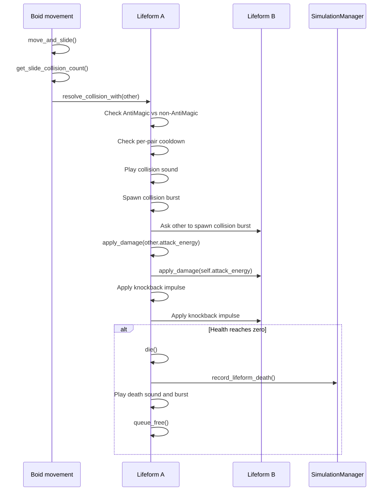

# Behaviour Tree And State Transition Diagrams

This document contains the rendered diagrams for the main lifeform decision systems.

The implementation is a priority-driven finite state machine in `lifeform_brain.gd`, but the behaviour priority diagram presents the decision order in a behaviour-tree style for easier explanation.

## Behaviour Priority Tree

## Main State Machine

## Evolution Flow

## Combat Sequence

## Mana Seeking Flow

## Notes For Explaining The System

- The code is not a formal behaviour tree implementation. It is a priority-driven finite state machine.
- The behaviour-tree view is useful because the brain checks high-priority needs first, then falls through to lower-priority social/evolution behavior.
- `Constrain` and `Avoidance` are not separate states. They are support behaviors kept active inside every state.
- Player pulses intentionally override normal autonomy for a short time, then release the lifeforms back to normal decision-making.
